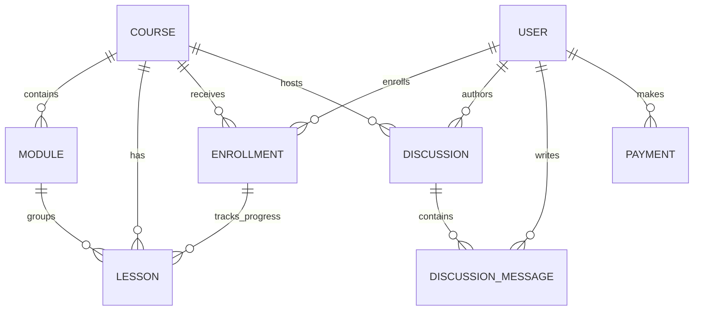

# LearnMate — Complete Interview-Ready Technical Documentation

## Part 1: Problem Understanding, System Design & Architecture

---

## 1. 🔍 PROBLEM UNDERSTANDING

### Real-World Problem
Traditional online learning platforms (Udemy, Coursera) are monolithic SaaS products that don't allow self-hosting, offer limited content authoring AI, and lock instructors into their ecosystems. Small organizations, bootcamps, and independent instructors need a **self-hosted, AI-augmented LMS** they can customize and own.

### Why Existing Solutions Fail

| Existing Solution | Limitation |
|---|---|
| **Udemy/Coursera** | No self-hosting; 50-75% revenue cut; no AI quiz generation; no content ownership |
| **Moodle** | PHP monolith; dated UI; no AI integration; heavy admin overhead |
| **Open edX** | Complex Django stack; requires dedicated DevOps team; overkill for small orgs |
| **Google Classroom** | No monetization; no video progress tracking; no anti-skip; limited customization |
| **Teachable/Thinkific** | SaaS lock-in; no Google Drive integration; expensive at scale |

### Target Users & Use-Cases
- **Independent Instructors**: Create/sell courses with AI-assisted quiz generation
- **Bootcamps/Orgs**: Self-host an LMS with role-based admin, payment integration (Razorpay)
- **Students**: Enroll, track granular video progress, participate in course discussions, earn certificates

---

## 2. 🧠 SYSTEM DESIGN (DEEP DIVE)

### High-Level Architecture

```
┌──────────────────────────────────────────────────────────────────┐
│                        CLIENT LAYER                              │
│  React 18 + Vite + TailwindCSS + React Router DOM                │
│  [AuthContext] [CourseContext] [Axios Interceptors]               │
│  Deployed: Vercel (SPA with rewrites)                            │
└────────────────────────┬─────────────────────────────────────────┘
                         │ HTTPS (CORS-protected)
                         ▼
┌──────────────────────────────────────────────────────────────────┐
│                      API GATEWAY LAYER                           │
│  Express.js (Node.js)                                            │
│  ┌─────────┐ ┌───────────┐ ┌──────────────┐ ┌───────────────┐   │
│  │  CORS   │ │ JSON Body │ │ JWT Protect  │ │ Role Authorize│   │
│  │ Filter  │ │ Parser    │ │ Middleware   │ │ Middleware    │   │
│  └─────────┘ └───────────┘ └──────────────┘ └───────────────┘   │
│  Deployed: Render / Railway                                      │
└────────────────────────┬─────────────────────────────────────────┘
                         │
          ┌──────────────┼──────────────┬──────────────┐
          ▼              ▼              ▼              ▼
   ┌────────────┐ ┌────────────┐ ┌──────────┐ ┌────────────┐
   │  MongoDB   │ │ Google     │ │ Gemini   │ │ Razorpay   │
   │  Atlas     │ │ Drive API  │ │ AI API   │ │ Payment    │
   │ (Mongoose) │ │ (Storage)  │ │ (LLM)   │ │ Gateway    │
   └────────────┘ └────────────┘ └──────────┘ └────────────┘
```

### Tech Choice Justifications

| Technology | Why Chosen | Alternative Considered |
|---|---|---|
| **React 18** | Component model fits course/lesson/quiz UIs; huge ecosystem; fast dev with Vite HMR | Next.js — SSR overkill for an SPA LMS; added complexity |
| **Vite** | 10x faster HMR vs CRA; native ES modules; proxy config for dev API | Webpack — slower cold starts; more config boilerplate |
| **Express.js** | Minimal, unopinionated; easy middleware composition for auth/upload/validation | Fastify — faster but smaller ecosystem for multer/googleapis |
| **MongoDB + Mongoose** | Polymorphic `content.data` field (video/quiz/text) maps naturally to documents; flexible schema evolution | PostgreSQL — rigid schema for polymorphic lesson types requires complex JOINs or JSONB |
| **JWT (stateless)** | No session store needed; works across Vercel + Render split deployment; 30d expiry for mobile-friendly UX | Session cookies — require sticky sessions or Redis; complex with split frontend/backend hosts |
| **Google Gemini API** | Free tier generous; structured JSON output for quiz gen; system instruction support | OpenAI — more expensive; similar capability for MCQ generation |
| **Multer + Google Drive** | Local-first upload with cloud fallback; Drive provides free CDN bandwidth | S3 — requires AWS account setup; costs money from byte 1 |
| **Razorpay** | India-focused payment gateway; simple order-verify flow; INR native | Stripe — not optimized for INR; higher fees in India |
| **TailwindCSS** | Rapid prototyping; utility-first approach; consistent design system | Vanilla CSS — slower iteration; harder to maintain consistency |

### Data Flow: Student Enrolls → Watches Video → Progress Saved

```
1. Student clicks "Enroll" → POST /api/enrollments/:courseId
2. Server checks: course exists? published? paid? (if paid → verify Payment record)
3. Creates Enrollment doc {student, course, progress: {currentLesson: firstLesson}}
4. Updates Course.enrolledStudents[] and totalEnrollments++
5. Student navigates to lesson → GET /api/courses/:id (populates lessons)
6. LessonPlayer renders <video> (local) or YT.Player (youtube)
7. timeUpdate/polling fires every 1s → anti-skip check (watchedUntil + 2s tolerance)
8. Every 4s throttled → PUT /api/enrollments/:courseId/lessons/:lessonId/progress
9. Backend upserts lessonWatch[] entry (monotonic increase only)
10. At 90% watched → auto-pushes to completedLessons[]
11. Recalculates duration-weighted progressPercentage
12. At 100% → enrollment.isCompleted = true; certificate downloadable
```

---

## 3. 🗄️ DATABASE DESIGN

### Entity-Relationship Diagram



### Schema Design (10 Collections)

#### User
```javascript
{
  name: String,           // max 50 chars
  email: String,          // unique, lowercase, regex-validated
  password: String,       // bcrypt hashed, select: false, conditional required
  googleId: String,       // sparse index for Google OAuth users
  authProvider: 'local' | 'google',
  role: 'user' | 'course_admin' | 'website_admin',
  profilePicture: String,
  bio: String,
  enrolledCourses: [ObjectId → Course],
  bookmarkedLessons: [ObjectId → Lesson]
}
// Pre-save hook: auto-hash password with bcrypt(10 rounds)
// Method: comparePassword() for login verification
```

#### Course
```javascript
{
  owner: ObjectId → User,    // course_admin who created it (access scoping)
  title: String,             // max 100, text-indexed
  description: String,       // max 1000, text-indexed
  shortDescription: String,  // max 200
  category: enum[10 values], // Programming, Design, Business, etc.
  level: 'Beginner' | 'Intermediate' | 'Advanced',
  instructor: { name, bio, avatar },
  price: Number,             // 0 = free
  duration: Number,          // minutes
  lessons: [ObjectId → Lesson],
  modules: [ObjectId → Module],
  enrolledStudents: [ObjectId → User],
  totalEnrollments: Number,
  tags: [String],
  isPublished: Boolean
}
// Indexes: text(title, description, tags), title:1, owner+createdAt
```

#### Lesson (Polymorphic Content)
```javascript
{
  title: String,
  description: String,
  content: {
    type: 'video' | 'youtube' | 'text' | 'quiz' | 'assessment',
    data: Mixed  // Schema varies by type:
    // video: { videoUrl, originalName, size, mimetype, storage, driveFileId, embedLink }
    // youtube: { youtubeUrl, videoId, thumbnailUrl }
    // text: { htmlContent }
    // quiz: { questions: [{ question, options[], correctAnswer, marks, explanation }] }
  },
  course: ObjectId → Course,
  order: Number,            // unique within course (compound index)
  isPreview: Boolean
}
// Index: { course: 1, order: 1 } UNIQUE — enforced with retry logic
```

#### Enrollment (Progress Tracking)
```javascript
{
  student: ObjectId → User,
  course: ObjectId → Course,
  progress: {
    completedLessons: [{ lesson: ObjectId, completedAt: Date }],
    currentLesson: ObjectId → Lesson,
    lessonWatch: [{           // granular video tracking
      lesson: ObjectId,
      watchedSeconds: Number,  // monotonic increase only
      durationSeconds: Number,
      updatedAt: Date
    }],
    progressPercentage: Number  // duration-weighted, 0-100
  },
  isCompleted: Boolean,
  completedAt: Date
}
// Index: { student: 1, course: 1 } UNIQUE — prevents double enrollment
```

#### Discussion & DiscussionMessage
```javascript
// Discussion: title, content, course, author, category, tags,
//   isPinned, isLocked, isResolved, upvotes[], downvotes[],
//   messageCount, lastActivity, lastMessage
// Indexes: course+createdAt, course+isPinned+lastActivity, course+category

// DiscussionMessage: content, discussion, author, parentMessage (threading),
//   editHistory[], attachments[], mentions[], reactions[],
//   upvotes[], downvotes[], isDeleted (soft delete), isBestAnswer
// Indexes: discussion+createdAt, discussion+parentMessage+createdAt
// Post-save hook: auto-increment parent discussion.messageCount
```

### Indexing Strategy

| Collection | Index | Purpose |
|---|---|---|
| Course | `{ title: 'text', description: 'text', tags: 'text' }` | Full-text search |
| Course | `{ title: 1 }` | Prefix (startsWith) search optimization |
| Course | `{ owner: 1, createdAt: -1 }` | Admin dashboard queries |
| Lesson | `{ course: 1, order: 1 }` UNIQUE | Prevent order collisions; sorted fetch |
| Enrollment | `{ student: 1, course: 1 }` UNIQUE | Prevent double enrollment |
| Discussion | `{ course: 1, isPinned: -1, lastActivity: -1 }` | Sorted discussion listing |
| Payment | `{ user: 1, course: 1 }` UNIQUE | One payment record per user-course pair |

### Query Optimization Decisions
- **`.lean()`** used in discussion queries — returns plain objects, 5-10x faster than Mongoose documents
- **Aggregation pipelines** in admin analytics — `$lookup` for enrollment counts avoids N+1 queries
- **`$addToSet`** for enrolledStudents — prevents duplicates without application-level check
- **Monotonic update** on watchedSeconds — `if (watchedSeconds > existing.watchedSeconds)` prevents replay attacks
